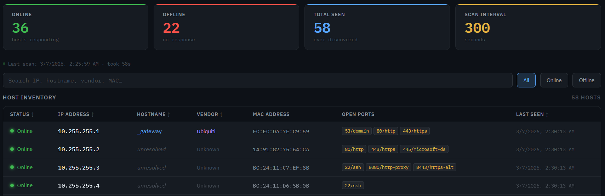

# NetInventory

A lightweight home network scanner and inventory dashboard. Sweeps your subnet with `nmap`, tracks every host it finds, and serves a clean web dashboard — all as a single `systemd` service.



## Features

- **Automatic subnet sweep** on startup and on a configurable interval
- **MAC → vendor lookup** (built-in table + optional full IEEE OUI file)
- **Reverse DNS** resolution for hostnames
- **Open port detection** across common services (SSH, HTTP, RDP, etc.)
- **Persistent SQLite database** — history survives restarts
- **Live web dashboard** with search, filter, and manual scan trigger
- **Zero runtime dependencies** beyond Python 3 + Flask + nmap

## Requirements

- Linux host (tested on Ubuntu 22.04 / Debian 12 / Raspberry Pi OS)
- Python 3.9+
- `nmap` (installed automatically by `install.sh`)
- Root / `sudo` (nmap needs raw sockets for ARP/MAC detection)

## Quick Install

```bash
git clone https://github.com/YOUR_USERNAME/netinventory.git
cd netinventory
sudo bash install.sh
```

The installer will:
1. Auto-detect your subnet
2. Ask for port and scan interval
3. Install `nmap` + `flask` via apt/pip
4. Copy files to `/opt/netinventory/`
5. Enable and start the `systemd` service

Then open **http://\<your-host-ip\>:8080** in a browser.

## Configuration

All settings are environment variables in the systemd service file (`/etc/systemd/system/netinventory.service`):

| Variable | Default | Description |
|---|---|---|
| `NETINV_SUBNET` | `192.168.1.0/24` | Subnet to scan |
| `NETINV_PORT` | `8080` | Web dashboard port |
| `NETINV_INTERVAL` | `300` | Seconds between scans |
| `NETINV_DB` | `/var/lib/netinventory/hosts.db` | SQLite database path |
| `NETINV_LOGLEVEL` | `INFO` | `DEBUG`, `INFO`, `WARNING` |

After editing the service file, reload with:
```bash
sudo systemctl daemon-reload && sudo systemctl restart netinventory
```

## Manual / Dev Run

```bash
python3 -m venv venv
venv/bin/pip install flask
sudo NETINV_SUBNET=192.168.1.0/24 NETINV_DB=/tmp/hosts.db venv/bin/python app.py
```

## Optional: Full OUI Vendor Database

The built-in vendor table covers ~40 common manufacturers. For full coverage, download the IEEE OUI list:

```bash
wget -O /opt/netinventory/oui.txt https://standards-oui.ieee.org/oui/oui.txt
sudo systemctl restart netinventory
```

## API

| Endpoint | Method | Description |
|---|---|---|
| `/` | GET | Web dashboard |
| `/api/hosts` | GET | All hosts as JSON |
| `/api/stats` | GET | Summary stats + scan history |
| `/api/scan` | POST | Trigger an immediate scan |

## Service Commands

```bash
journalctl -u netinventory -f     # live logs
systemctl status netinventory      # service status
systemctl restart netinventory     # restart
sudo bash uninstall.sh             # remove everything
```

## Project Structure

```
netinventory/
├── app.py                  # Flask app + scanner engine
├── templates/
│   └── index.html          # Dashboard (single-file, no build step)
├── install.sh              # Interactive installer
├── uninstall.sh            # Removal script
├── netinventory.service    # Systemd unit (reference copy)
├── requirements.txt
└── README.md
```

## License

MIT
